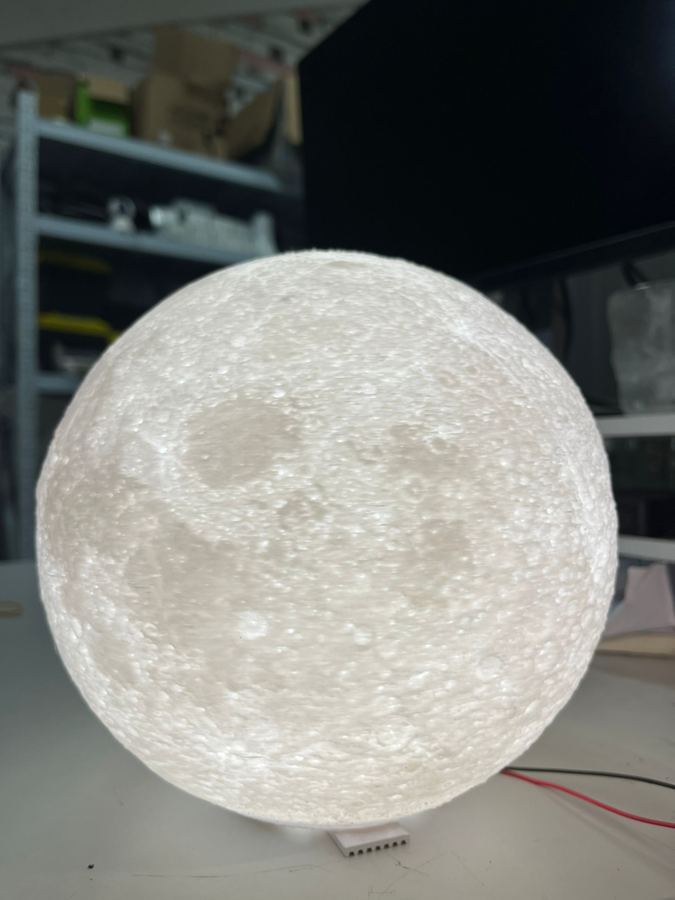

# 物联网月球灯

本项目是一个基于 ESP32 的月球灯软件端，通过 WiFi 与月球灯硬件端进行通信，实现对月球灯的控制。

本项目是由我们三个人合作完成的项目：

| 分工        | 文档                             | Github                                    |
| :---------- | :------------------------------- | :---------------------------------------- |
| 电路设计    | [code/README.md](code/README.md) | [mishe](https://github.com/mishe)         |
| 软件程序    | [code/README.md](code/README.md) | [MR-Addict](https://github.com/MR-Addict) |
| 3D 模型设计 | [code/README.md](code/README.md) | [ptsfdtz](https://github.com/ptsfdtz)     |
