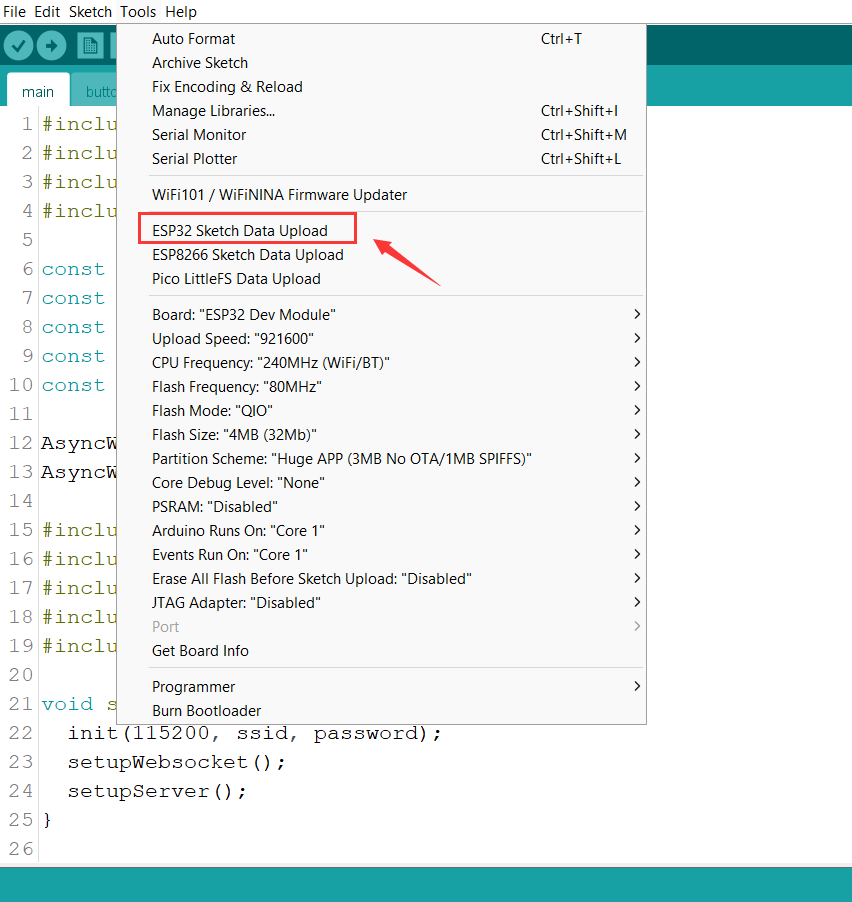

# 月球灯软件端

## 1. 项目介绍

本仓库是月灯的软件控制代码，基于 `Arduino` 框架开发。

月球灯支持 `Web端`、`API端`， `WebSocket端`和`物理按钮`四种控制方式。web 端同时使用了 API 和 WebSocket 来控制 LED 灯的开关，以保证准确控制 LED 灯的同时实现多个客户端同步的功能。


## 2. 项目结构

- **main.ino** 程序入口
- **init.h** 为初始化代码
- **button.h** 为物理按钮控制代码
- **server.h** 为 Web 服务器代码
- **websocket.h** 为 WebSocket 服务器代码
- **data** 文件夹为 Web 服务器的静态文件

## 3. API 接口

### 3.1 API 接口说明

| 接口名   | 请求方式 | 返回值            | 说明            |
| :------- | :------- | :---------------- | :-------------- |
| /api/led | GET      | 当前的 LED 灯状态 | 获取 LED 灯状态 |
| /api/led | POST     | 当前的 LED 灯状态 | 打开 LED 灯     |
| /api/led | DELETE   | 当前的 LED 灯状态 | 关闭 LED 灯     |

### 3.2 API 接口示例

#### 3.2.1 获取 LED 灯状态

Curl 示例：

```bash
curl -X GET http://moonlight.lan/api/led
```

JavaScript 示例：

```js
fetch("http://moonlight.lan/api/led")
  .then((res) => res.json())
  .then((res) => console.log(res));
```

### 3.2.2 打开 LED 灯

Curl 示例：

```bash
curl -X POST http://moonlight.lan/api/led
```

JavaScript 示例：

```js
fetch("http://moonlight.lan/api/led", { method: "POST" })
  .then((res) => res.json())
  .then((res) => console.log(res));
```

### 3.2.3 关闭 LED 灯

Curl 示例：

```bash
curl -X DELETE http://moonlight.lan/api/led
```

JavaScript 示例：

```js
fetch("http://moonlight.lan/api/led", { method: "DELETE" })
  .then((res) => res.json())
  .then((res) => console.log(res));
```

## 4. 如何开发

### 4.1 安装需要的库

将 `libraries` 文件夹中的所有文件夹复制到 `~/Documents/Arduino/libraries` 的库文件夹中完成库的安装。

### 4.2 添加 ESP32 开发板

在 `Arduino` 的 `首选项` 中添加 `ESP32` 开发板的地址：

```txt
https://raw.githubusercontent.com/espressif/arduino-esp32/gh-pages/package_esp32_index.json
```

然后在 `开发板管理器` 中安装搜索安装 `ESP32` 开发板即可。

### 4.3 安装 ESP32 文件系统上传工具

将 tools 文件夹完整复制到 `~/Documents/Arduino/tools` 的工具文件夹中，然后再打开 Arduino IDE 就可以看到 **ESP32 Sketch Data Upload** 工具了。



通过 Arduino IDE 打开该项目，然后点击工具栏中的 **工具** -> **ESP32 Sketch Data Upload** 就可以将 `data` 文件夹中的文件上传到 ESP32 的文件系统中了。

> 参考教程：
>
> - [ESP32 文件系统上传工具](https://randomnerdtutorials.com/install-esp32-filesystem-uploader-arduino-ide/)

### 4.4 编译并上传

在 Arduino IDE 中选择开发板为 `ESP32 Dev Module`，然后点击工具栏中的 **工具** -> **开发板** -> **ESP32 Dev Module**，注意下面勾出的选项。


然后修改 main.ino 中的 WiFi 连接信息，将 WiFi 的 SSID 和密码修改为你自己的 WiFi 信息。

```cpp
const char* ssid = "STAS-507";
const char* password = "manke666";
```

最后点击上传就可以了。
